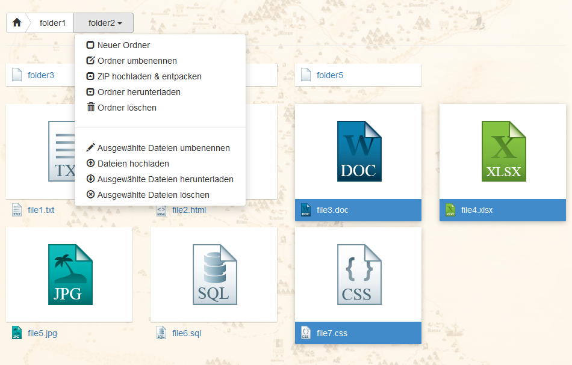

.. ==================================================
.. FOR YOUR INFORMATION
.. --------------------------------------------------
.. -*- coding: utf-8 -*- with BOM.

.. include:: ../Includes.txt

Introduction
============

What does it do?
----------------

This extension (f3manager) is a frontend file manager based on typo3 FAL.

It extends the extension "fal_securedownload" with additional configuration for writing permission.

It implements a frontend plugin - inspired by Google Drive.
The eligible User - defined in the Backend - can

- Create folders
- Rename folders
- Download folders as ZIP-file
- Upload and extract ZIP-files
- Delete folders

- Rename files
- Download single and multiple files
- Upload single and multiple files
- Delete files

.. _screenshots:

Screenshots
-----------

This chapter should help people figure how the extension works. Remove it
if not relevant.

   **Image 1:** Example of the Frontend File Manager